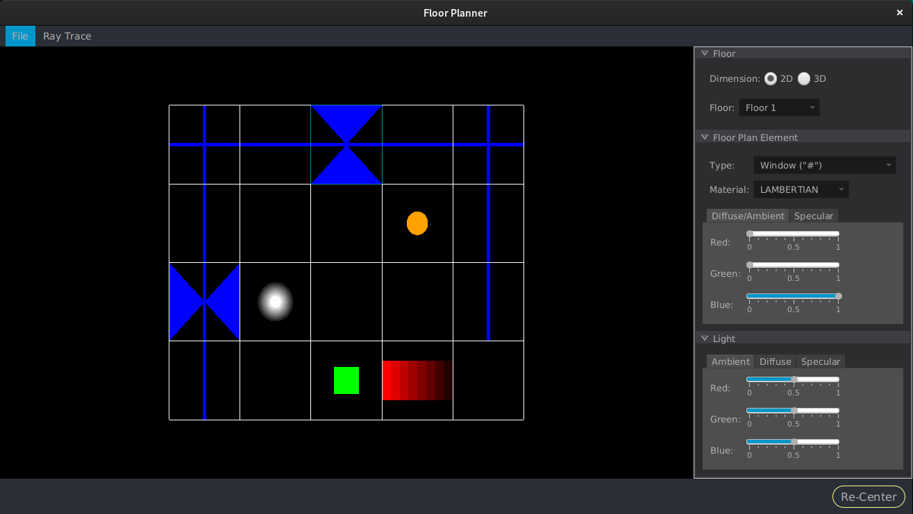
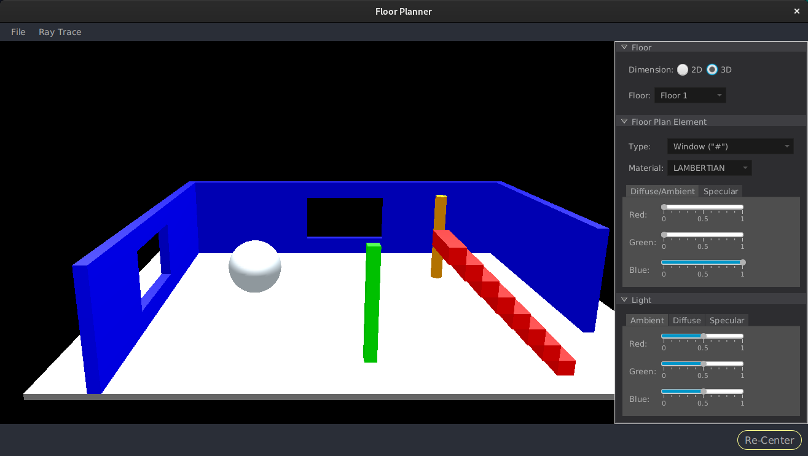
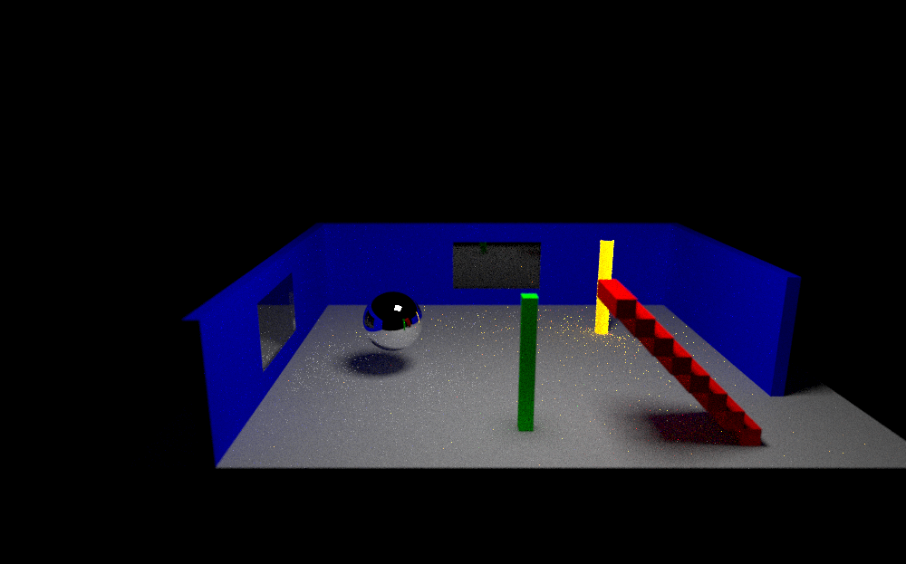

# FloorPlanner

The FloorPlanner is a basic CAD program for creating and managing floor plans in 2D and 3D. Additionally users can generate a ray traced image of the current view in 3D. It is based on a set of programming assignments I had in one of my graduate school classes a long time ago in a city not to far away...

## Technologies

The application is written using Java 17 and JOGL. The user interface is developed using JavaFX, and the 2D and 3D views of the floor plan are rendered using JOGL.

The ray trace code is based on the [_Ray Tracing in One Weekend_](https://raytracing.github.io/books/RayTracingInOneWeekend.html) series. I worked through each of the books and implemented most of the functionality from there. I did skip some of the features contained in the book, like motion and volumes (i.e. smoke and fog) since these are not needed in the floor plan. Some of the worlds used in the series are available to generate from the "Ray Tracer" menu item. Selecting anything other than "3D Rendering" will generate the corresponding ray traced image from the series.

> NOTE: This application was developed and tested on RHEL 9, and as such I've only included native JOGL files needed for linux. I do not expect this application to work as is on Windows or Mac since I have not included the native JOGL files needed for those operating systems.

## Features

The goal of the project is to allow users to create and manage basic floor plans in 2D, view and move around the floor plan in 3D, and ultimately generate a ray traced image of the current view in 3D. A floor plan has a width and height (represented as a matrix for each floor), can be 1 or more floors, and each floor can have a set of basic elements assigned to the indexes in the matrix associated with the floor.

### Create/Load and Save Floor Plan

Users can create new or load existing floor plans using the corresponding options in the `File` menu. They can also save their changes at any time from the same menu.

### 2D View

The initial view of a floor plan (after one is created or loaded) will display a grid in 2D of the first floor (or the only floor if the plan is just 1 floor). When in 2D users can click any cell in the grid to change the element type in that cell as well as the material type using the corresponding drop down fields in the top right corner of the screen.

> NOTE: Changing the material type will only effect the ray traced image.

### 3D View

To switch between 2D and 3D simply click the corresponding option in the `Dimensions` menu. Once in 3D users can move around in the floor plan using the arrow buttons on their keyboard. They can also change the angle (up/down) of movement using the `pg up` and `pg dn` buttons. There is a `Re-Center` button which will bring the user back to the "bottom" of the floor plan.

### Color and Lighting

Users can change the color for each element in the floor plan using the color sliders in the right pane (below the element and material type drop downs). Color changes will be reflected in 2D, 3D, and the ray traced image.

> NOTE: I do not currently save colors for the elements since that was not part of the original requirements for the project, and I am trying to stick with most of the original requirements (for now...).

Changing the lighting works similar to changing colors, however it only effects the 3D view.

### Ray Traced Images

A ray traced image can be rendered from the current view in 3D by selecting `3D Rendering` in the `Ray Trace` menu. Users can also generate images from the Ray Tracing In One Week series by selecting any of the options in the `RTIOW Series Scenes` menu (found below the `3D Rendering` menu item).

A progress indicator will display when the ray tracer is running to generate an image, and will automatically close when complete. This is a nice addition I added from the original project I wrote in grad school as it does give me an idea of how long the ray tracing process might take. I did not have that in my original project, and would just have to guess how long the ray tracing process would take (which was not very fun). Some ray traced images can take a while to render depending on settings used and the hardware where the application is running.

> NOTE: Ray traced images are saved with a ppm extension, based on code from RTIOW series.

## Screenshots

Below is a screenshot of the JavaFX UI showing a loaded floor plan in 2D. The UI uses a standard BorderPane layout with a toolbar in the north pane, the JOGL viewport in the center, material and light controls in the right pane, and the `Re-Center` button for re-centering in the 3D view in the bottom pane.

*2D View*

And the same floor plan in 3D.

*3D View*

## Ray Traced Images

The following sections include sample ray traced images generated by the FloorPlanner application.

### Floor Plan

Below is a sample ray traced image of the floor plan showin in the screen shots above. The sphere is metal, and you can see a reflection of the scene in front of it (albeit very small; should probably create a better floor plan to show this...).

*Ray Trace View*

### Ray Tracing in One Weekend Series

Below are images rendered from the Ray Tracing in One Weekend Series.

*[_Ray Tracing in One Weekend_](https://raytracing.github.io/books/RayTracingInOneWeekend.html) Final Image*

*[_Ray Tracing: The Next Week_](https://raytracing.github.io/books/RayTracingTheNextWeek.html) Standard Cornell Box*

*[_Ray Tracing: The Rest of Your Life_](https://raytracing.github.io/books/RayTracingTheRestOfYourLife.html) Cornell Box with reflections*